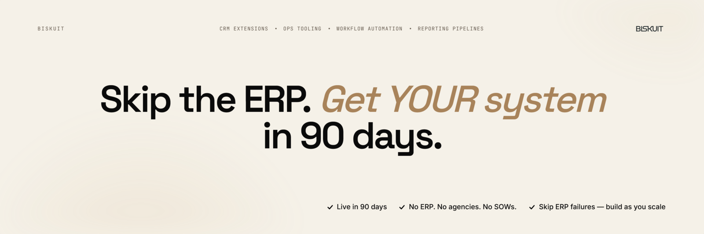
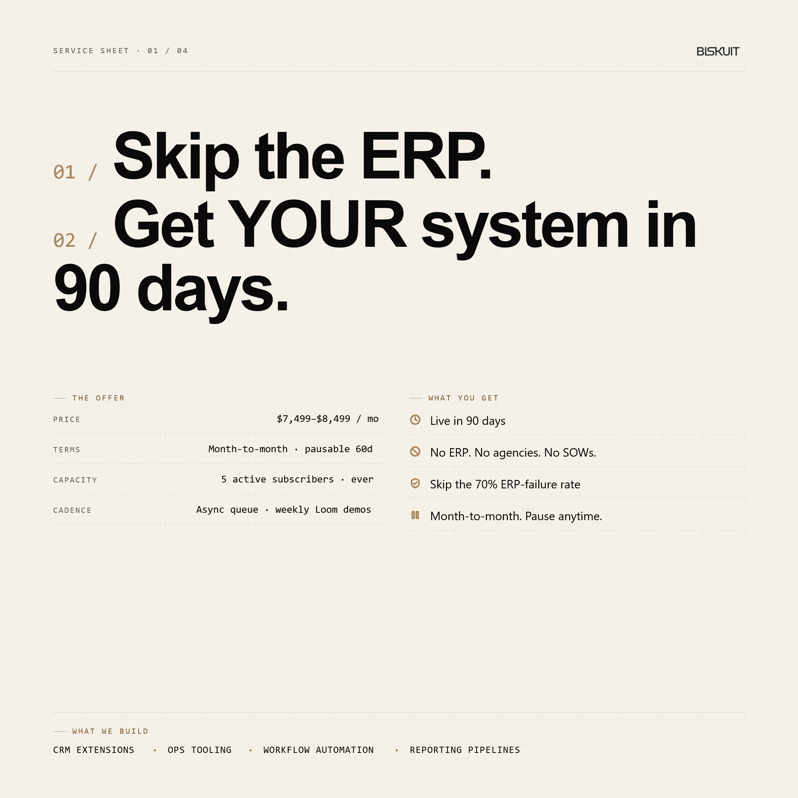

  

    

  <h1>Skip the ERP. Get YOUR system in 90 days.</h1>

  
<strong>Anti-ERP. Custom internal systems for scaling US companies.</strong>

  

    <a href="https://cal.com/biskuit/intro"><strong>📞 Book a call with Aqeel</strong></a>
    &nbsp;·&nbsp;
    <a href="https://biskuits.duckdns.org"><strong>🌐 biskuits.duckdns.org</strong></a>
  

---

We build the operational system your team actually runs on. Custom software, shipped in 90 days. Instead of an 18-month ERP rollout with a 70% failure rate, a $150k/year ops hire, or another generic SaaS that forces your business to bend to the tool.

## 🛠 What we build

Custom internal systems, one bottleneck at a time:

- Inventory systems
- Order management
- Internal dashboards
- Workflow automation
- CRM extensions
- Procurement flows
- Reporting pipelines

Whatever your team currently runs in spreadsheets, Notion docs, and duct-taped SaaS, we turn into working software that fits your actual workflow.

## 🧠 The mechanism: Software as living SOPs

Your processes don't sit in a Notion doc nobody reads. They're built into the software your team uses every day. When work changes, the software changes. No drift between docs and reality. New hires execute the process by using the system. Onboarding cuts from weeks to days.

## 🚀 How the engagement works

| | |
|---|---|
| **Cycle** | One active request at a time, unlimited queue |
| **Timeline** | First system live in 90 days, then iterate on the next bottleneck |
| **Terms** | Month-to-month. Pause or cancel anytime |
| **Ownership** | You own all the code from day one |
| **Capacity** | Currently onboarding ~4 clients per quarter |
| **Guarantee** | First system in 90 days, or your next month is on us |

   
  
    

## 🎯 Who this is for

Scaling US companies (Series A+, post-revenue) that have outgrown generic SaaS, can't justify an ERP rollout, and need someone who can identify the highest-impact bottleneck and ship working software for it.

If you're a founder, COO, or Head of Ops drowning in operational chaos, that's the seat we built Biskuit for.

## 📬 Let's talk

- **Book a call:** [cal.com/biskuit/intro](https://cal.com/biskuit/intro)
- **Site:** [biskuits.duckdns.org](https://biskuits.duckdns.org)
- **LinkedIn:** [Aqeel Hashim](https://www.linkedin.com/in/m-aqeel-hashim) · [Biskuit Company Page](https://www.linkedin.com/company/biskuitio)
- **X:** [@AqeelMHashim](https://x.com/AqeelMHashim)

---

  Anti-ERP. Custom internal systems for scaling US companies. Live in 90 days. Month-to-month. You own the code.

